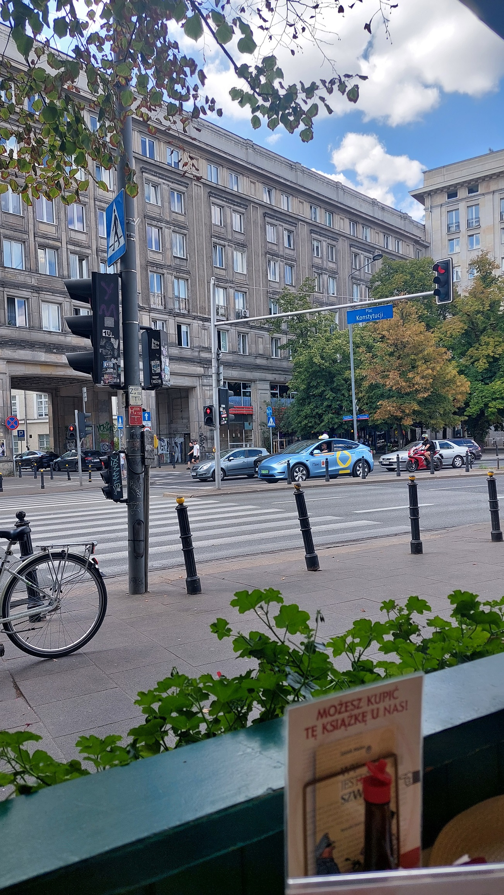

### Given data

 

Street called: Konstytucji (Poland) 
Letter on pamphlet: You can buy these book form us (google translate) 

Quick search on google maps takes us here. 
 
The buildings had similar architecture so I looked at the surrounding restaurants and found this. Right below central. 
 
 
At coords: 52.22148863394642, 21.01606045233723 

`grodno{52.221,21.016}`